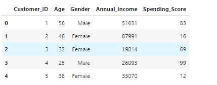
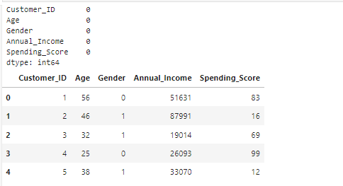
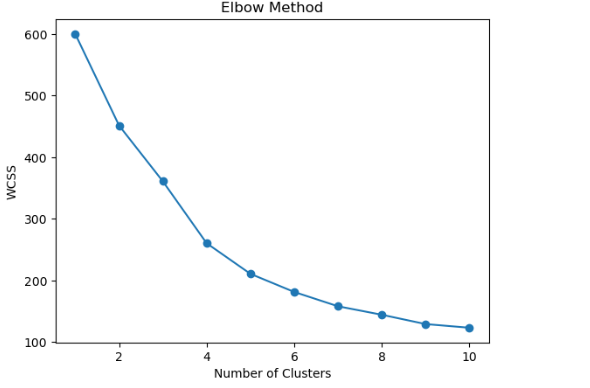
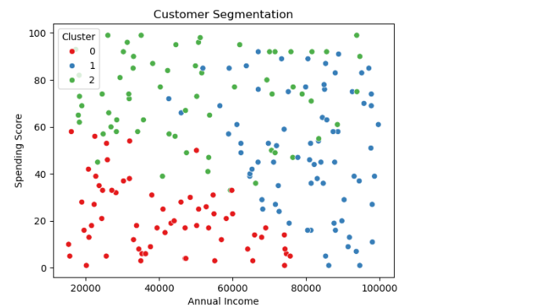
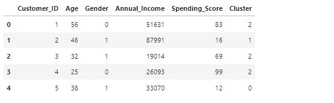
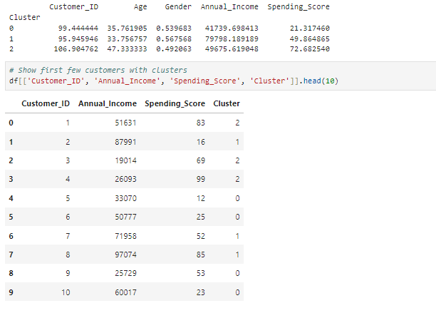

# Customer Segmentation using K-Means Clustering

## Project Description
This project segments customers into different groups based on their purchasing behavior using clustering techniques like K-Means. It helps businesses understand customer patterns and improve marketing strategies.

## Objective
- Group customers based on similar characteristics  
- Identify different customer types  
- Improve marketing strategies  
- Increase sales and customer satisfaction  

## Problem Statement
Businesses often:
- Treat all customers equally  
- Cannot identify high-value customers  
- Waste marketing resources  

## Proposed Solution
The system:
- Takes customer data (income, spending, etc.)
- Applies K-Means clustering
- Divides customers into meaningful groups

## Technologies Used
- Python
- Pandas
- NumPy
- Scikit-learn
- Matplotlib / Seaborn
- Jupyter Notebook

## Dataset Description
Typical features include:
- Age  
- Gender  
- Annual Income  
- Spending Score  
- Purchase Frequency  

## Methodology
1. Data Collection  
2. Data Preprocessing  
3. Feature Selection  
4. Finding optimal clusters (Elbow Method)  
5. Apply K-Means Clustering  
6. Model Training  
7. Visualization  
8. Interpretation  

## System Modules
- Data Input Module  
- Data Processing Module  
- Clustering Module  
- Visualization Module  
- Analysis Module  

## Expected Output
- Customers grouped into clusters  
- Visual graphs showing segmentation  
- Business insights for each group

## Output Screenshots

### Dataset Preview

### Data Preprocessing

### Elbow Method

### 📈 Customer Clusters

### Clustered Data Output

### Cluster Summary

These outputs demonstrate how customers are grouped into different segments using K-Means clustering and how meaningful insights can be derived from the data.

## Advantages
- Better customer understanding  
- Targeted marketing  
- Increased profit  
- Personalized services  

## Limitations
- Sensitive to outliers  
- Requires correct K value  
- Depends on data quality  

## Future Enhancements
- Advanced clustering algorithms (DBSCAN, Hierarchical)  
- Real-time segmentation  
- CRM integration  
- AI-based recommendations  

## Author
**Varshini S**
